# ATX4VC: ATX Power on Retro Computers!

[Buy ATX4VC](https://www.tindie.com/products/dekuNukem/atx4vc-atx-power-on-retro-computers/) | [Discord](https://discord.gg/T9uuFudg7j) | [User Manual](#user-manual) | [Table of Contents](#Table-of-Contents)

ATX4VC is an all-in-one controller for **using ATX power supply on vintage computers**.

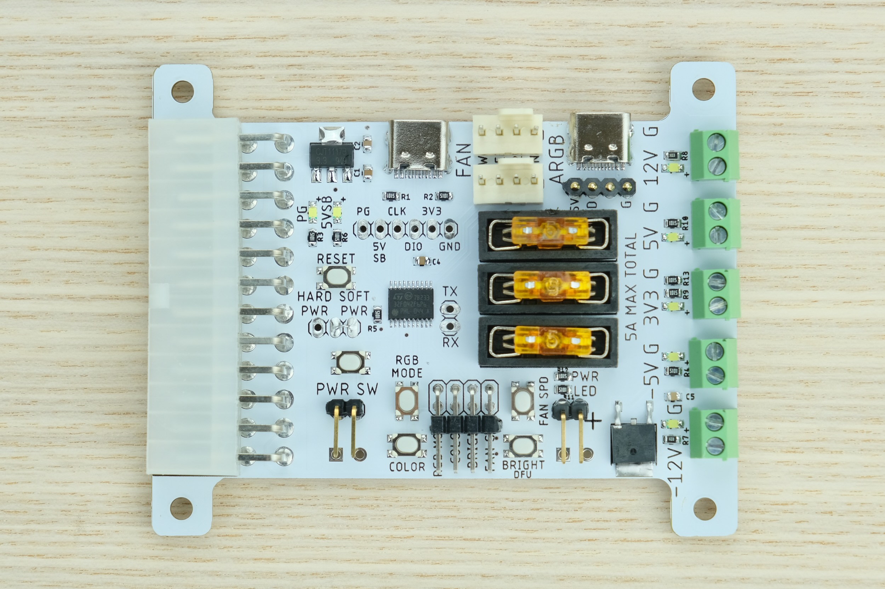

ATX4VC combines many convenient features in one place:

* All common voltages: +12V, +5V, +3.3V, -5V, -12V. Fused.

* Power button and power LED headers

* **Two** 4-pin PWM fan headers. Manual fan speed or via **temperature probe**.

* **Two** Addressable RGB(ARGB) headers

* **Two** USB-C ports for power output and firmware update

ATX4VC can be used to:

* Replace retro computer power supplies

* Add cooling and lighting upgrades

* Test and diagnose vintage hardware

* As general-purpose multi-voltage bench PSU

## Showcase

[In my RGBeeb project](https://github.com/dekuNukem/RGBeeb), ATX4VC (seen lower right) powers a BBC Micro with +5V and -5V using a full-size ATX PSU.

But of course, a **pico ATX PSU** makes more sense due to its compact size. 

Here it replaces the failed PSU in my Osborne 1, providing +12V and +5V.

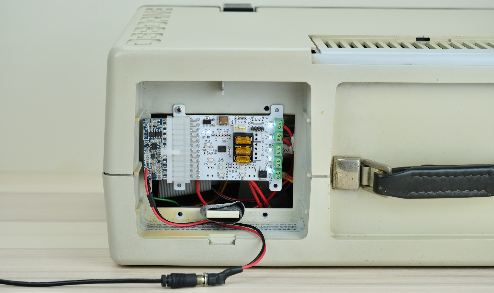

I even took it to a coffee shop and wrote most of this very document! But that's the story for another day.

You can also just use it as a multi-voltage bench PSU for testing and diagnostics.

Here it powers a Macintosh Plus motherboard with +12V, +5V, and -12V.

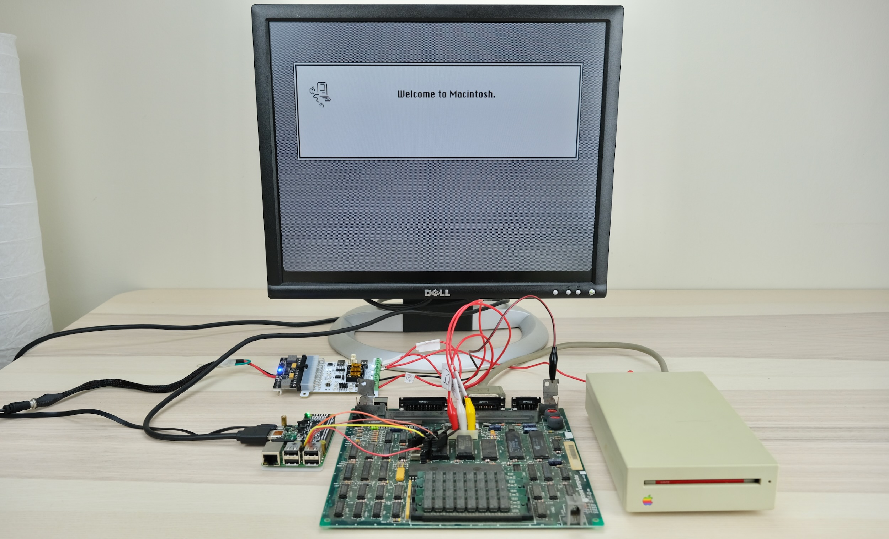

## Why / Project Goals

Power supplies are a major failure point of old computers today. Those early PSUs are heavy, inefficient, runs hot, and (slightly) explosive! After 40 odd years, many are not working, or worse might cause damage with out-of-spec voltages.

ATX4VC is designed to replace them with much more reliable modern ATX power supplies, and as a tool to help test and diagnose vintage computers. 

## Table of Contents

[Quick Start Guide](#Quick-Start)

[Power Button and Power LED](#Power-Button-and-Power-LED)

[Power Connection](#Power-Connection)

[Current Limit](#Current-Limit)

[Fuses](#Fuses)

[Fan Headers](#Fan-Headers)

[Temperature Probe](#Temperature-Probe)

[Addressable RGB (ARGB)](#Addressable-RGB-ARGB)

[USB-C Power Output](#USB-C-Power-Output)

[Dimension Drawings](#Dimension-Drawings)

[Hard Power](#Hard-Power)

[RGBA over USB](#RGBA-over-USB)

[Additional Headers](#Additional-Headers)

[USB Firmware Update](#USB-Firmware-Update)

## User Manual

### Quick Start

* Make sure the jumper is in "soft power" setting (right two pins)

* Plug in ATX connector

* Press the power button

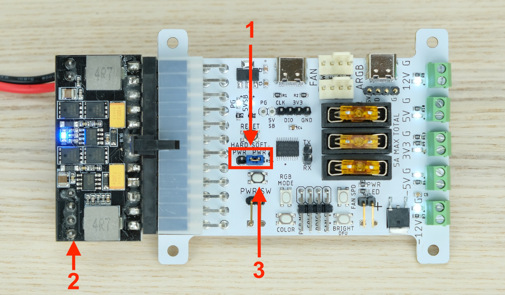

The PSU should turn on, and all voltage rail LEDs should light up. 

That's the gist of it! But **please do keep reading** for the complete info.

### Power Button and Power LED

You can use the built-in power button, or connect an additional button to the header.

Both momentary switch and toggle switch are supported.

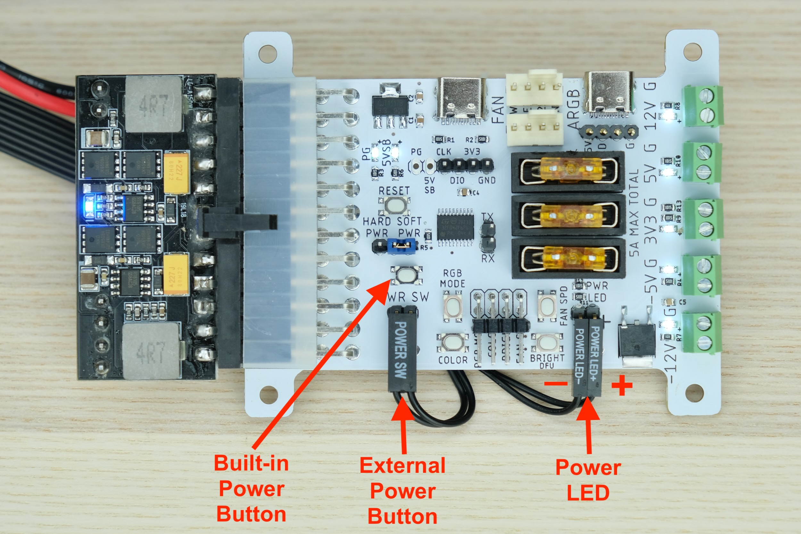

You can also add an external power LED. Be ware of polarity.

**No need for external resistors**. A 2.5K resistor is built-in.

### Power Connection

Observe the voltage on each terminal block.

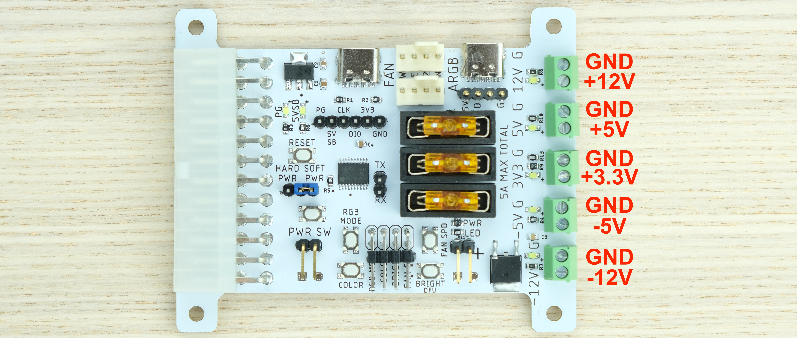

Loosen the screw, insert the cable into the hole, and tighten it again.

Don't leave conductor exposed! Trim it to prevent shorts.

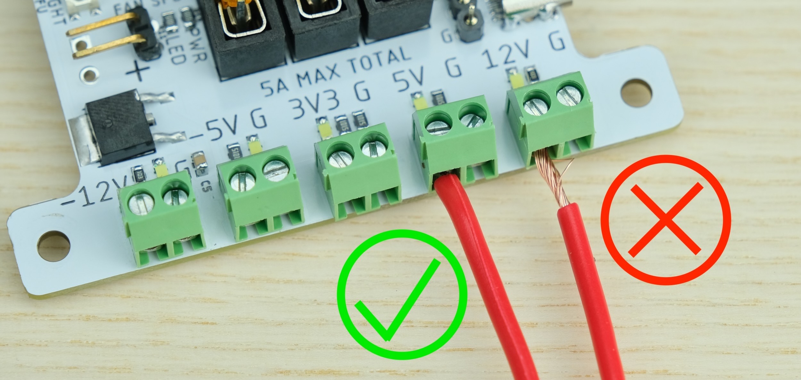

### Current Limit

ATX4VC has current limit as follows:

* **`5 AMPS MAX`** OVER **ANY SINGLE RAIL**

* **`7 AMPS MAX`** **TOTAL CURRENT** OVER ALL RAILS

If more is needed, **tap the power directly** from a Molex connector.

See your PSU label or datasheet to see how much current it can provide:

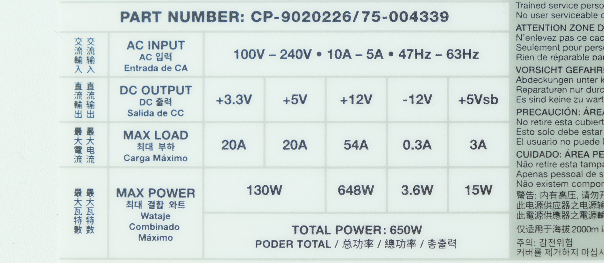

### Fuses

+12V, +5V, and +3.3V are fused.

* USE FUSES RATED **5A OR LESS**

* **DO NOT BYPASS FUSES**

ATX4VC uses common car fuses. Regular, Mini, and low-profile Mini all will work. Simply push into the holder.

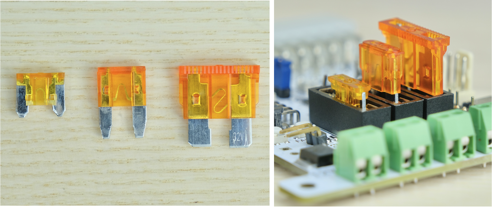

Negative rails are not fused because they are low-current (around 200mA), and built-in protection is adequate.

### Fan Headers

Two PWM Fan headers are available. You can plug in standard 12V PC fans, both 3-Pin and 4-Pin.

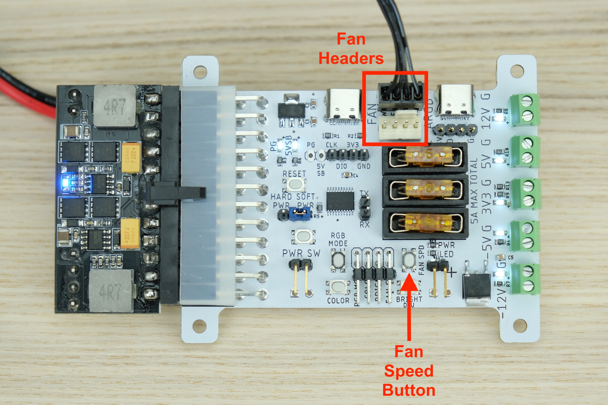

Press `FAN SPD` button to cycle through different speeds:

| Fan Speed (%) |                     Note                    |
|:-------------:|:-------------------------------------------:|
|       0       | May or may not stop depending on fan itself |
|       20      |                                             |
|       40      |                                             |
|       55      |                                             |
|       65      |                                             |
|       80      |                                             |
|       90      |                                             |
|      100      |                3 fast blinks                |
|      Auto     |                5 slow blinks                |

Speed control only available on 4-Pin fans. 3-Pin fan will always run at full speed.

### Temperature Probe

ATX4VC supports the DS18B20 temperature sensor. They are inexpensive and very popular in Arduino projects.

Beware of counterfeits! Best to get them from a reputable distributor like [Sparkfun](https://www.sparkfun.com/products/11050) or [Adafruit](https://www.adafruit.com/product/381).

Connect the headers. Usually VCC is red, GND is black, DATA is yellow.

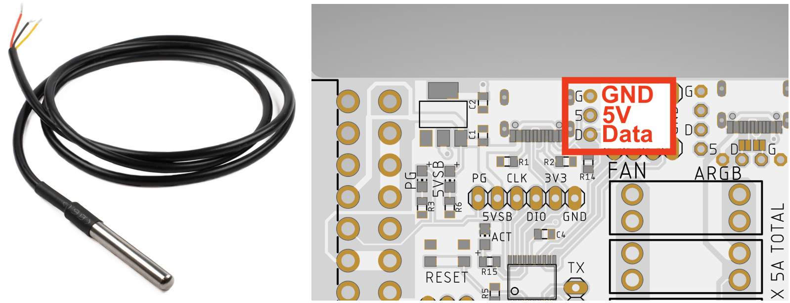

Press **FAN SPD** button until the user LED `slowly blinks 5 times`. Now fan speed will depend on the temperature reading.

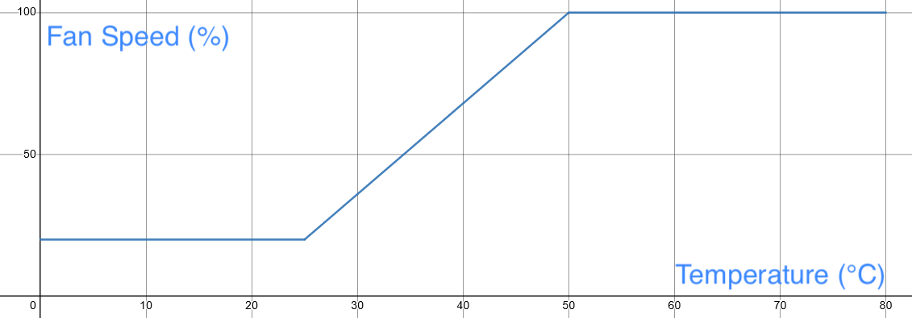

The fan starts to speed up at 25°C, and reaches full speed at 50°C. If probe is not detected, it will run at full speed.

### Addressable RGB (ARGB)

Two standard ARGB headers are available. Simply plug them in. Up to 100 ARGB LEDs are supported.

Use **RGB MODE** button to change animation type, **BRIGHT** and **COLOUR** button to adjust brightness and colour.

Hold the button to cycle through faster.

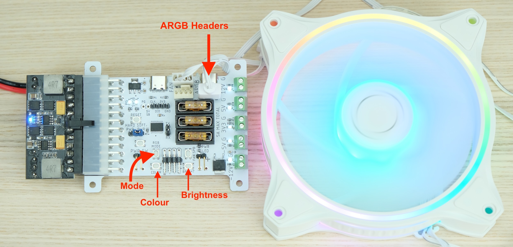

### USB-C Power Output

Two USB-C connectors are available for powering external devices.

The left port provides 5V Standby, which is active even when PSU is off. Although max current is limited (typically 1 to 2 Amps)

The right port is on regular 5V rail. It can provide more current, but only available when PSU is on.

Those ports are **output only**, don't try to backfeed them with another powered device.

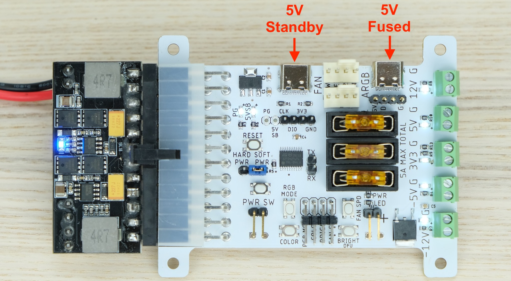

### Dimension Drawings

ATX4VC is compatible with **2.5 inch PC drive bay**, and is compact enough to fit in most vintage computers.

Use M3 screws and nuts. Dimension drawing below:

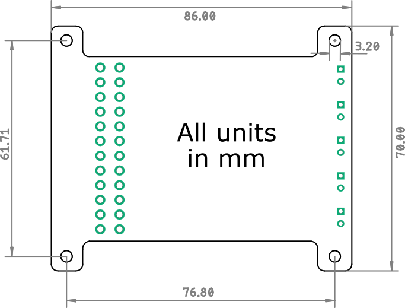

## Additional Features

### Hard Power

Move the jumper to the left for hard power.

This shorts PS_ON pin to GND, and turns on PSU immediately when plugged in.

### RGBA over USB

You can use the rightmost USB-C port to carry ARGB power and signal in one cable.

Short the jumper with some solder to put ARGB data on the D+ line. [Seen in RGBeeb](https://github.com/dekuNukem/RGBeeb#did-anyone-say-rgb).

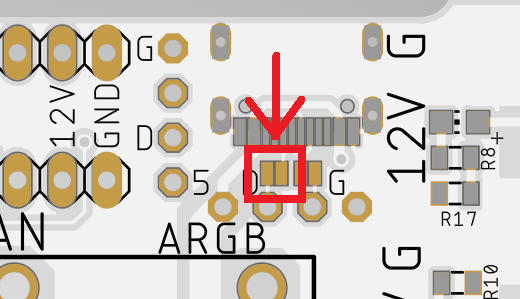

### Additional Headers

A few more signals are available on headers.

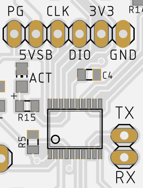

|  Pin |    Function   | Note                                             |
|:----:|:-------------:|--------------------------------------------------|
|  PG  |   Power Good  | High (+5V) when output is correct and stable     |
| 5VSB |   5V Standby  | Available when PSU is off, max current 2A usually|
|  CLK |     SWCLK     | For microcontroller programming                  |
|  DIO |     SWDIO     | For microcontroller programming                  |
|  3V3 |   3.3V Power  |                                                  |
|  GND |     Ground    |                                                  |
|  TX  | UART Transmit | Prints some debugging messages @ 115200bps       |
|  RX  |     Unused    |                                                  |

## USB Firmware Update

TURN OFF AND UNPLUG ATX PSU BEFORE STARTING.

Under construction ...

## Table of Contents (again)

[Quick Start Guide](#Quick-Start)

[Power Button and Power LED](#Power-Button-and-Power-LED)

[Power Connection](#Power-Connection)

[Current Limit](#Current-Limit)

[Fuses](#Fuses)

[Fan Headers](#Fan-Headers)

[Temperature Probe](#Temperature-Probe)

[Addressable RGB (ARGB)](#Addressable-RGB-ARGB)

[USB-C Power Output](#USB-C-Power-Output)

[Dimension Drawings](#Dimension-Drawings)

[Hard Power](#Hard-Power)

[RGBA over USB](#RGBA-over-USB)

[Additional Headers](#Additional-Headers)

[USB Firmware Update](#USB-Firmware-Update)

## Questions or Comments?

Feel free to ask in official [Discord Chatroom](https://discord.gg/T9uuFudg7j), raise a [Github issue](https://github.com/dekuNukem/ATX4VC/issues), or email `dekunukem` `gmail.com`!

