# ATX4VC: ATX Power on Retro Computers!

[Buy ATX4VC](https://www.tindie.com/products/dekuNukem/atx4vc-atx-power-on-retro-computers/) | [Discord](https://discord.gg/T9uuFudg7j) | [User Manual](#user-manual) | [Table of Contents](#Table-of-Contents)

ATX4VC lets you **use ATX power supply on vintage computers**.

* Plug in ATX PSU on one end
* Get 12V, 5V, 3.3V, -12V, -5V out the other!

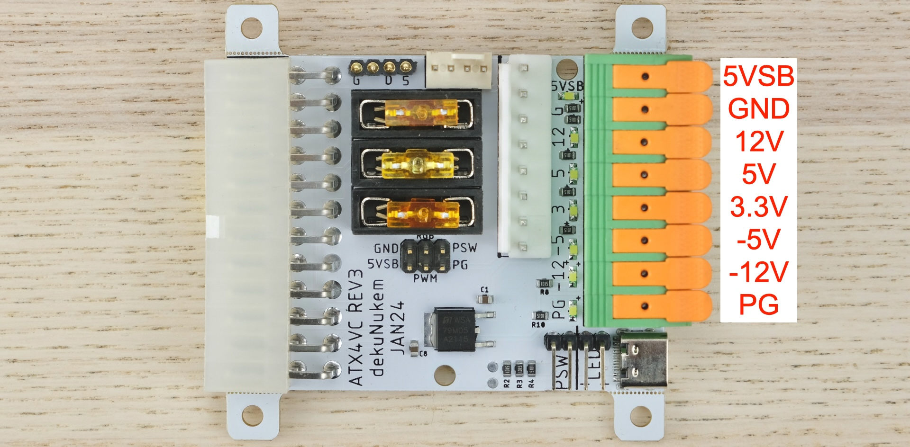

Features:

* All common voltage rails: +12V, +5V, +3.3V, -5V, -12V.
	* Also `5V Standby` and `Power-Good`
* Toolless Lever-Actuated Terminal Block
* USB-C Power Output
* 2x PC Fan Headers

You can use ATX4VC to:

* Replace retro computer PSUs
* Test and diagnose vintage hardware
* As general-purpose multi-voltage bench PSU

## Get ATX4VC

[Click me to get one!](https://www.tindie.com/products/dekuNukem/atx4vc-atx-power-on-retro-computers/)

## PicoRC

Also [check out PicoRC](https://picorc.com) for **device-specific** and **lower-cost** PicoPSU adaptors.

## Showcase

Here ATX4VC replaces the dead PSU in my IBM 5155 Portable PC, providing +12, +5, -12, and -5V.

Note the significant simplification and space/weight saving.

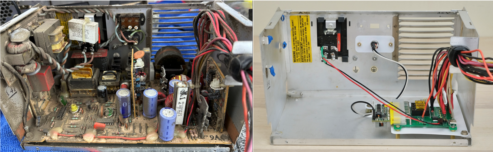

It also works as a **multi-voltage bench PSU** for testing and diagnostics.

Here it powers a Macintosh Plus motherboard with +12, +5, and -12V.

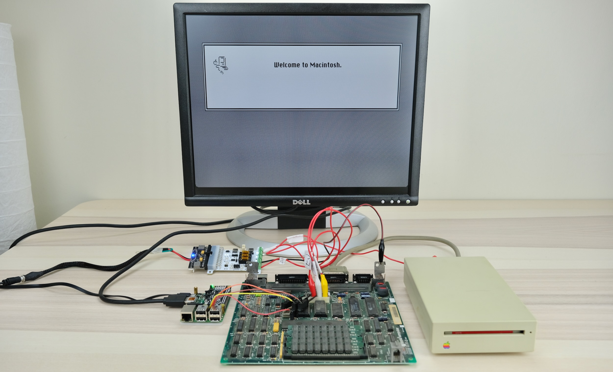

## Why

Power supplies are a major failure point of old computers today.

Those early PSUs are heavy, inefficient, and (slightly) explosive! After 40 odd years, many are not working, or worse might cause damage with out-of-spec voltages.

ATX4VC is designed to replace them with much more reliable modern ATX PSUs, and help test and diagnose vintage computers.

## User Manual

### ATX vs Pico PSU

ATX4VC works with **any ATX PSU**.

Although for **permanent retrofitting**, a **PicoPSU** is recommended due to its compact size.

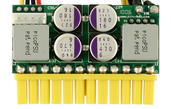

* [Official website](https://www.mini-box.com/DC-DC) and [distributors](https://www.mini-box.com/site/resellers.html)
    * The cheapest **80W** one should be plenty for most
    * The **160W** variant is recommended if using many expansion cards and/or **spinning hard drive**
* Avoid **generic clones**
    * They over-rate and are of low quality
* A power brick with **12V DC** and **center positive** 5.5x2.5mm barrel jack is also needed.
    * They are very popular and you might already have one
    * Make sure it has enough wattage

### Quick Start

* Don't connect any load yet!

1. Plug in ATX connector
2. On **Power Mode** switch, select **Soft Power** (left position).
3. Press the button

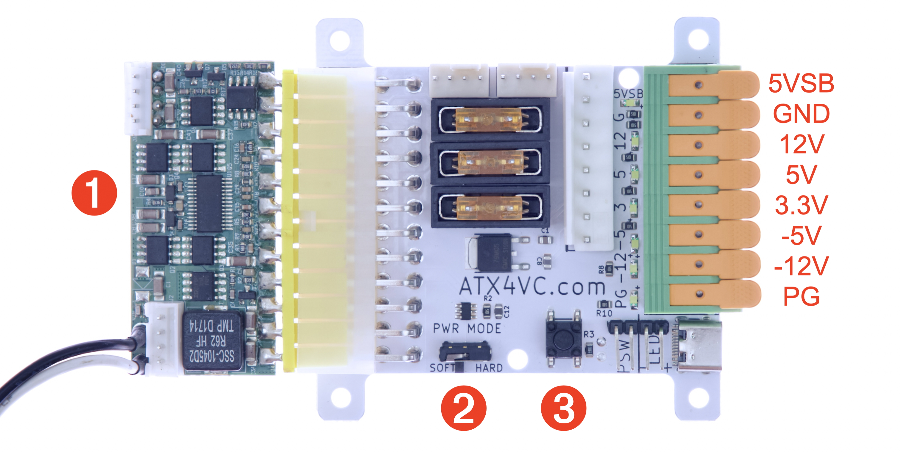

PSU should turn on, voltage rail LEDs should light up. 

That's the gist of it! **Please do keep reading** for more info.

### Power Modes

* Soft Power
    * **Short press** once to turn on
    * Short press again to turn off
    * Suitable for **momentary push buttons**
* Hard Power
    * **Hold down** to power on
    * **Release** to power off
    * Suitable for **latching buttons / flip switches**
    * Connected directly to ATX **PS_ON** Signal

### External Power Button and Power LED

You can also attach an **external power button** and **power LED** to the headers below:

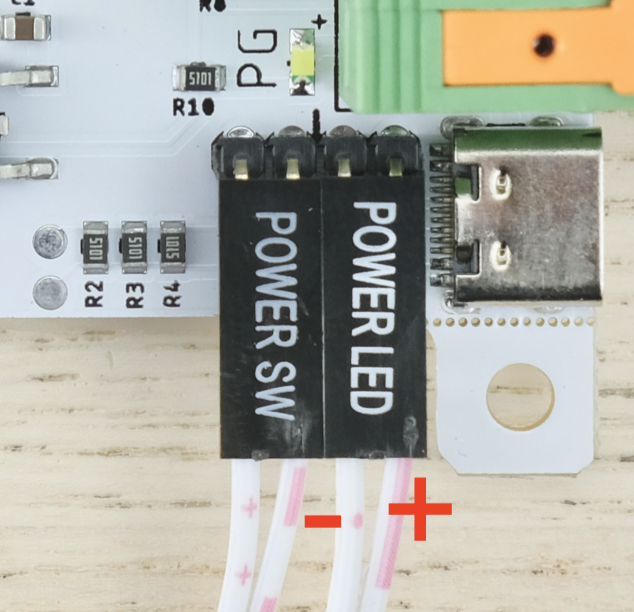

* Note LED polarity
* LED header has built-in **330 Ohm** resistor 
* Select suitable power mode
    * Soft Power: Momentary Pushbuttons
    * Hard Power: Latching Buttons / Flip Switches

### Power Connection

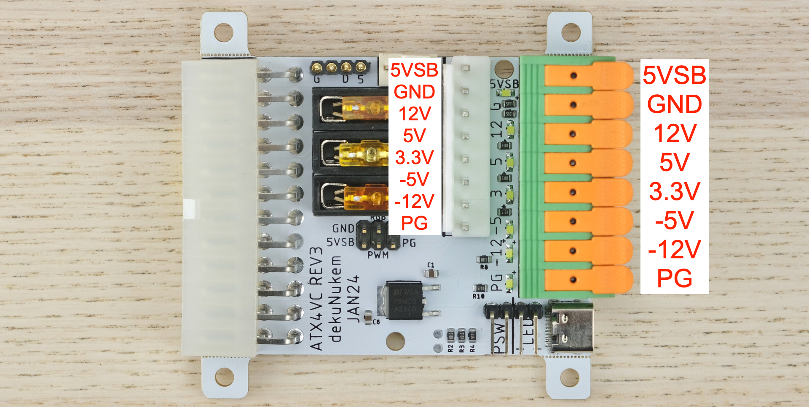

* See photo for power rails
    * For aux output harness, use **8P JST VH 3.96** female connector.
* 5VSB = 5V Standby
    * Available even when PSU is off
* Power Good Signal
    * 5V when all rails are stable
    * 0V otherwise

To connect a wire:

* Strip the insulation about 12mm / 0.5in.
* Lift handle, insert, push back down.

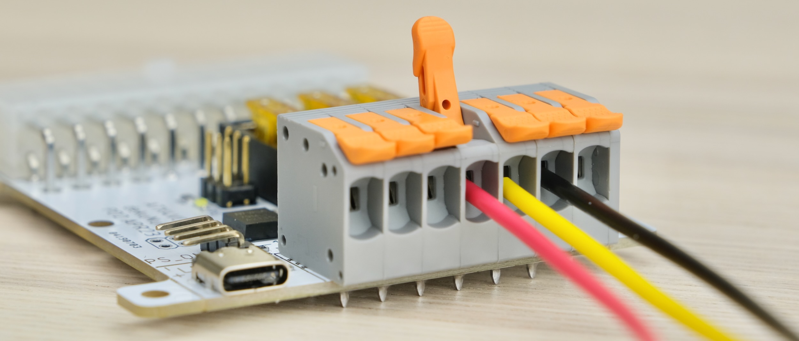

Also, make sure the conductor is thick enough!

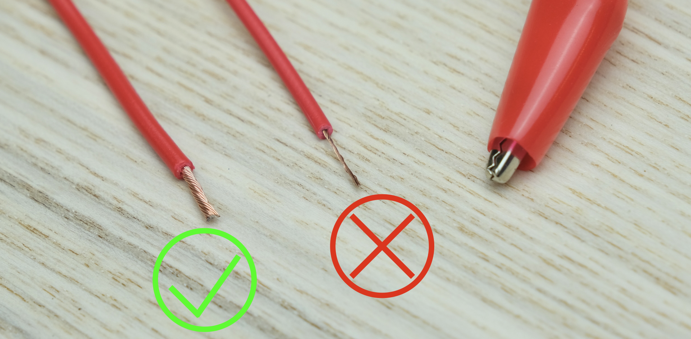

Label the rails, vinyl stickers are available on the [product page](https://www.tindie.com/products/dekuNukem/atx4vc-atx-power-on-retro-computers/):

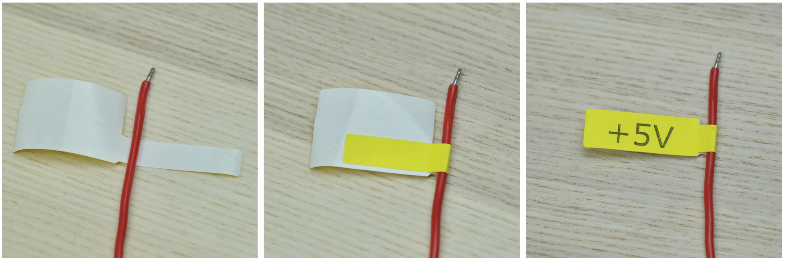

### Pre-flight Checks

Before powering up:

* Double check the **correct voltage terminal** is used
* Check for **dead shorts** between each voltage rail and GND, and between themselves!

Once powered up:

* Check voltage readings on each rail

Remember that ATX4VC **DOES NOT** monitor or condition voltage rails, so ensure the PSU itself is of good quality and trustworthy!

### Current Limit

* **`5 AMPS MAX`** OVER **ANY SINGLE RAIL**
* **`7 AMPS MAX`** **TOTAL CURRENT** OVER ALL RAILS

If more is needed, **tap the power directly** from a Molex connector.

See your PSU label or datasheet to see how much current it can provide:

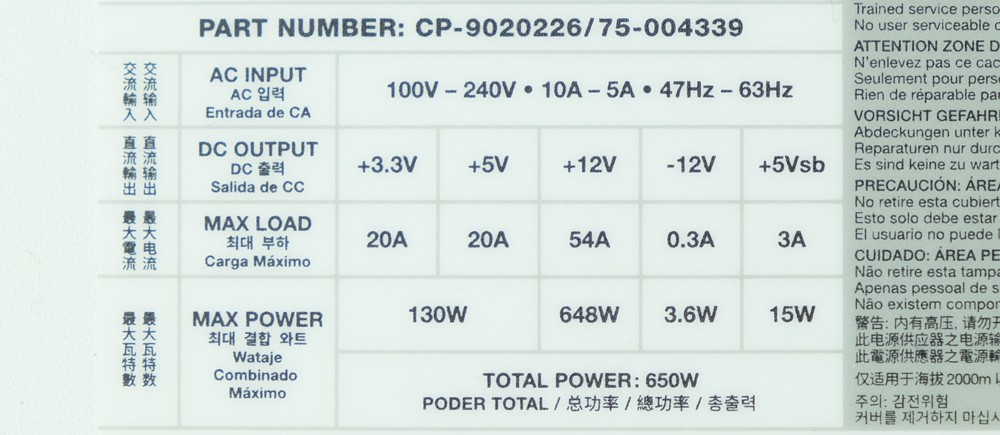

### Fuses

* USE FUSES RATED **5A OR LESS**
* **DO NOT BYPASS FUSES**

ATX4VC uses common **automotive fuses**.

Regular, Mini, and Low-profile Mini all work.

Simply push into the holder.

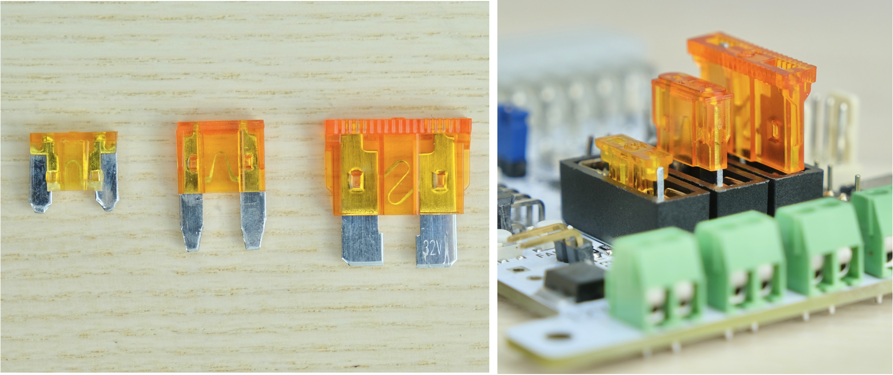

### Fan Headers

Two PC Fan headers are available. You can plug in any regular **12V PC fan**, both 3-Pin and 4-Pin.

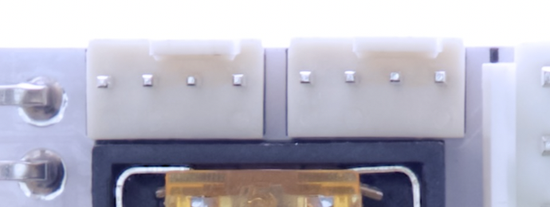

### USB-C Power Output

An USB-C port is available for **powering external devices**.

* **OUTPUT ONLY**, **DO NOT BACKFEED** with another powered device.

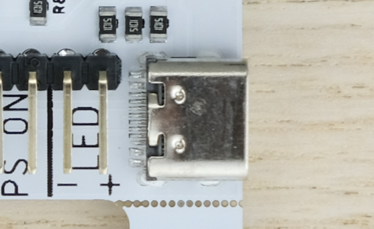

## Questions or Comments?

Feel free to ask in official [Discord Chatroom](https://discord.gg/T9uuFudg7j), raise a [Github issue](https://github.com/dekuNukem/ATX4VC/issues), or email `dekunukem` `gmail.com`!

