# ATX4VC Pico for Macintosh 128K / 512K / Mac Plus

This adaptor lets you use modern **Pico ATX PSU** in Macintosh 128K / 512K / Plus computers.

It plugs into the motherboard and bypasses the unreliable built-in PSU all together.

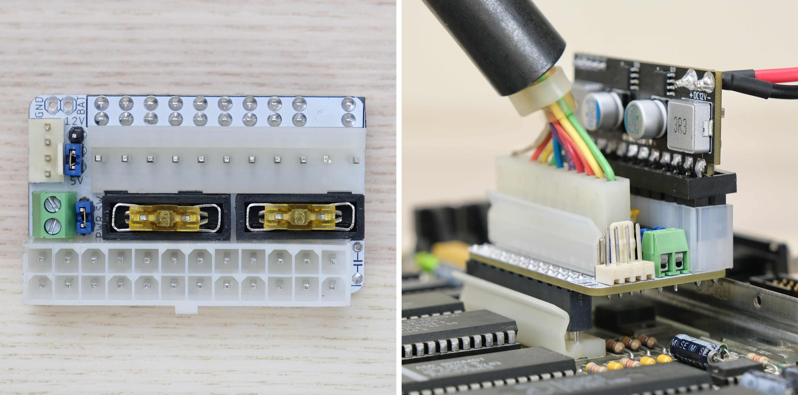

## Features

* **Non-destructive** and reversible

* Easy assembly and installation

* **PC fan header** for added cooling

* **Fused** positive rails

* Power switch and battery-backup headers

## Get One / Other Stuff

Click me to get one!

Full-fat ATX4VC

USB4VC

## Table of Contents

- [Getting a Pico PSU](#getting-a-pico-psu)

- [Kit Assembly](#kit-assembly)

- [Board Features](#board-features)

- [Pre-installation Checks](#pre-installation-checks)

- [Installation](#installation)

- [Power Routing](#power-routing)

- [Troubleshooting](#troubleshooting)

- [Questions or Comments?](#questions-or-comments)

## Getting a Pico PSU

PicoPSU are tiny ATX power supplies for small PCs, but perfect for retro computers as well.

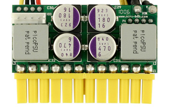

* [Official website](https://www.mini-box.com/DC-DC) and [distributors](https://www.mini-box.com/site/resellers.html). Even the cheapest 80W one should be plenty.

* You can also find generic ones on eBay/Amazon/Aliexpress by searching `Pico ATX`. They are *not that* cheap, so might as well support the official product.

* A power brick with **12V DC** and **center positive** 5.5x2.5mm barrel jacks is needed.

* Those are very popular and you might already have one. Make sure it has enough wattage.

Remember that this solution is **only as good as your PicoPSU and 12V Brick**, so don't skimp on them!

## Kit Assembly

### Already assembled?

[Click me to jump to next section](#board-features) (Board Features).

### Required tools

* Soldering Iron

* Solder

* Flux

* Multimeter

### Soldering Notes

Nothing too tricky in this kit, all basic through-hole stuff.

If this is your first time, a few tips:

* Make sure your soldering iron has **proper temperature control**, NOT the cheap ones with just a power switch! They get way too hot and will damage the PCB.

* Use **leaded solder**, much easier to work with.

* Set the temperature around 320C / 600F

* Use plenty of flux, makes everything much easier. You can clean it off afterwards.

* [This video](https://www.youtube.com/watch?v=AqvHogekDI4) covers the basics pretty well, you can also watch others by searching `how to solder`.

* Try your local makerspace or university lab!

### Assembly

Parts are slightly different for Mac Plus and Mac 128K/512K, make sure to follow the correct one!

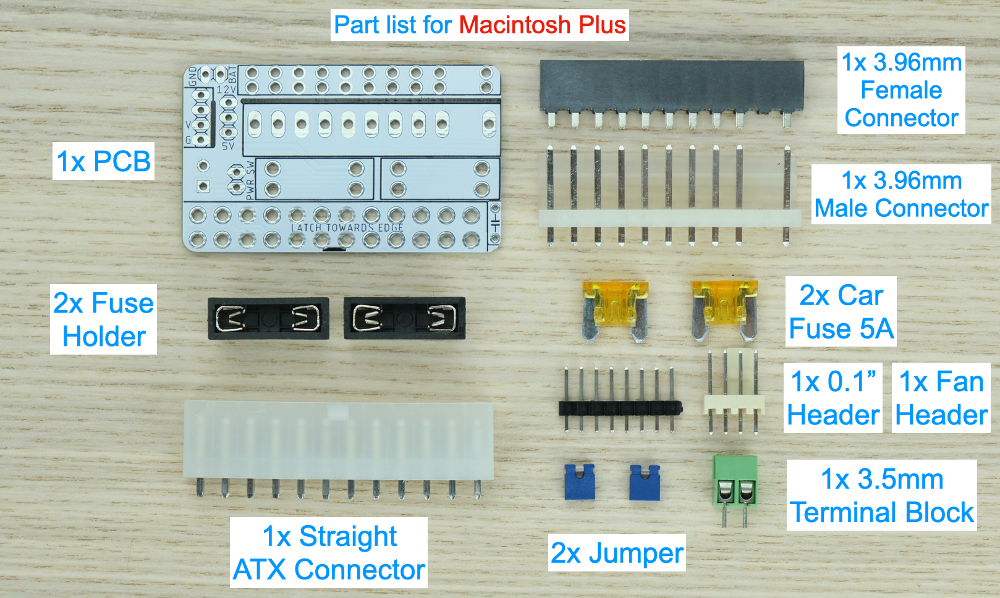

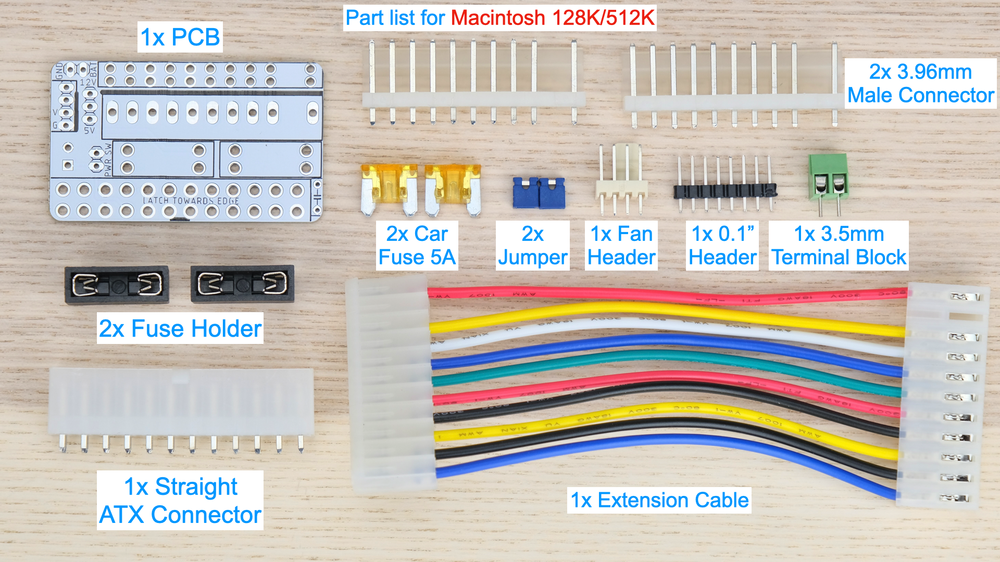

Observe the assembly notes and reference photos:

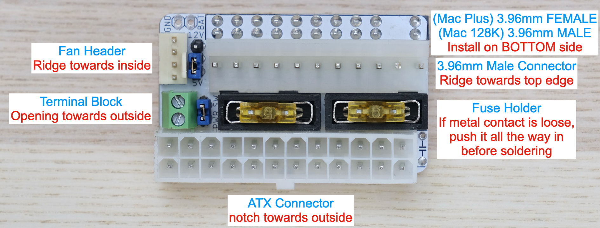

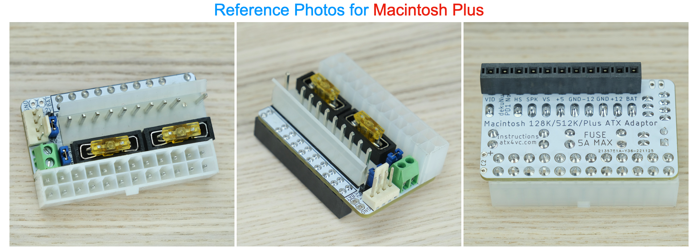

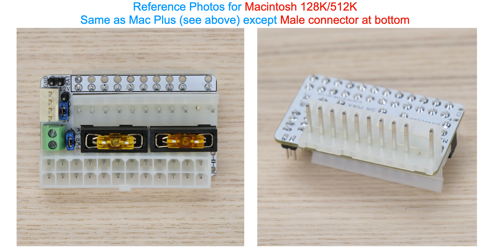

Insert component, hold it in place with masking tape or sticky putty. Flip it over and solder **a single pin** first, then make sure the part is **straight in all directions**.

If not, you can adjust it while melting that single pin. Once happy, solder the rest of the pins.

It's a good idea to start from shortest component to tallest.

Make sure the solder melts properly and wets both the pin and pad to prevent cold solder joints, especially on thicker power pins.

Push in the fuse and insert the jumpers as shown.

### Inspection

* Compare with the reference photo and notes, make sure everything is in correct orientation.

* Solder joints should be **shiny and smooth**. If you see spikes, put on more flux and melt it again.

* There must be **no solder bridges**. If any, put on flux and melt it to remove.

### Cleaning

This is optional, but I like to clean off the flux with 90%+ isopropyl alcohol. Submerge and scrub with a toothbrush.

Make sure it is **completely dry** before proceeding.

## Board Features

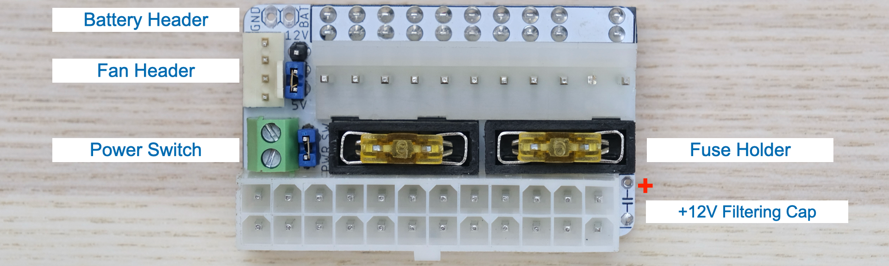

### Power Switch

The terminal block (and pin header) is connected to the ATX `PS_ON` pin.

You can wire a flip switch to it, or leave it jumpered so it turns on immediately when plugged in.

### PC Fan Header

* Any standard 3 or 4-pin PC fan should work

* Run it at 5V or 12V by changing the jumper

* 12V is full speed, 5V is much quieter.

### Fuse

* Use common car fuse RATED **5A OR LESS**

* Regular, Mini, and low-profile Mini all will work. Simply push into the holder.

* **DO NOT BYPASS FUSES**

### +12V Filtering Cap (Optional)

* You can add a filtering cap to +12V rail, note the polarity if using electrolytic caps.

### Battery Header (Optional)

* You can connect a 4.5V battery to the header.

## Pre-installation Checks

From the back, use a multimeter to **check for dead shorts** between each power pin and GND:

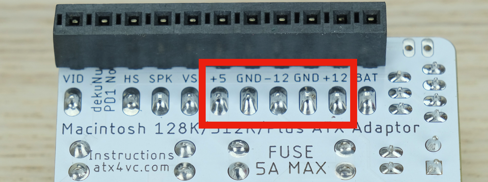

If all good, plug in Pico ATX PSU, and then power jack.

The PSU should turn on, measure the voltage on each rail and confirm they are within spec.

## Installation

During disassembly, it's a good idea to **take plenty of photos**. It never hurts to have reference.

### Remove Back Cover

⚠️**Dangerous CRT voltage inside**! Make sure the computer is **unplugged for a few hours**! Or discharge the CRT yourself.

You'll need a LONG **Torx T15 screwdriver**.

Recommended steps:

* Lay the Mac face down on a soft cloth

* Loosen all the screws. Two at the bottom, one behind battery door, two in the handles.

* Take photos of which goes in where, the lower two has a thinner thread.

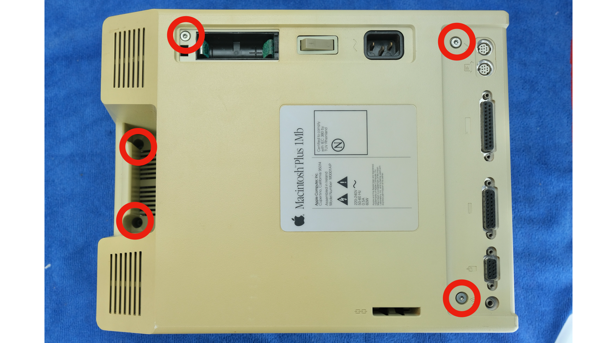

* Remove all the screws **apart from a single one inside the handle**.

* Put the screwdriver on that single loosened screw, grab the handle and try **gently** lifting up. The back cover should pop loose.

* Slowly **lift straight up** to remove the back cover.

⚠️ **DO NOT TOUCH ANY CRT COMPONENTS** if you don't know what you're doing!

### Install the Adaptor

* Unplug the floppy and power cable from motherboard.

* **DO NOT PULL STRAIGHT UP**, or you might break the CRT neck!

* Wiggle gently until loose, and carefully unplug.

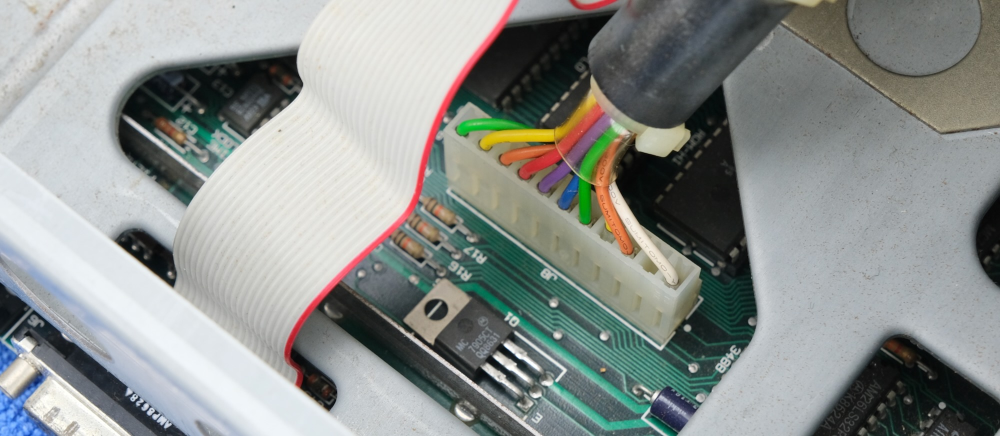

* Plug the Pico PSU and the power cable into the adaptor.

* The missing wire should match the missing pin on the socket.

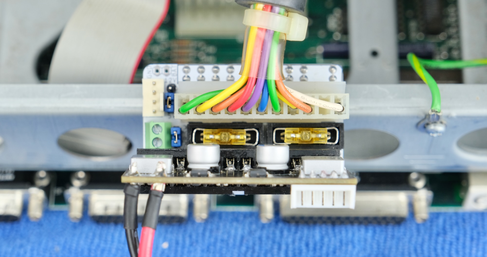

* **[MAC PLUS]** Plug the adaptor back into the motherboard.

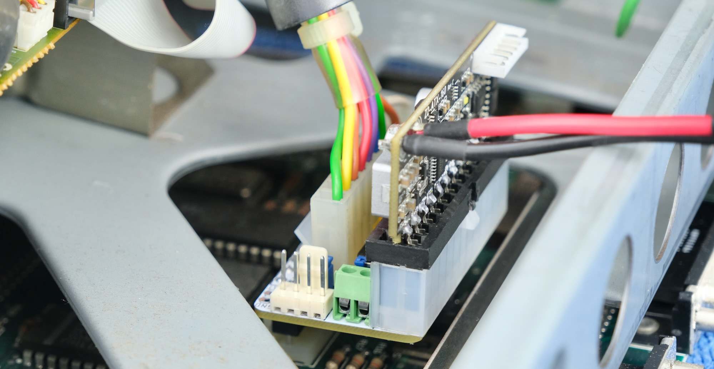

* It should go in firmly, although not reach the bottom.

* **Bend down and double check from both sides** that the pins are lined up and NOT off-by-one!

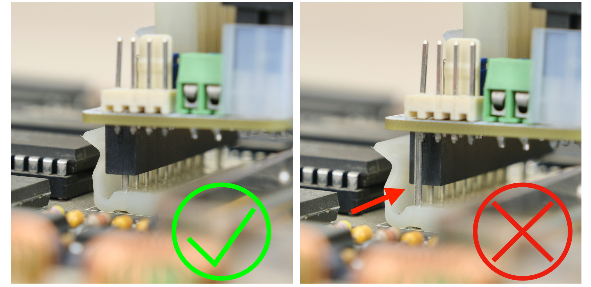

* **[MAC 128K/512K]** Plug the extension cable into motherboard, then bottom of the adaptor.

* Again, make sure the **missing wire matches the missing pin** on the socket.

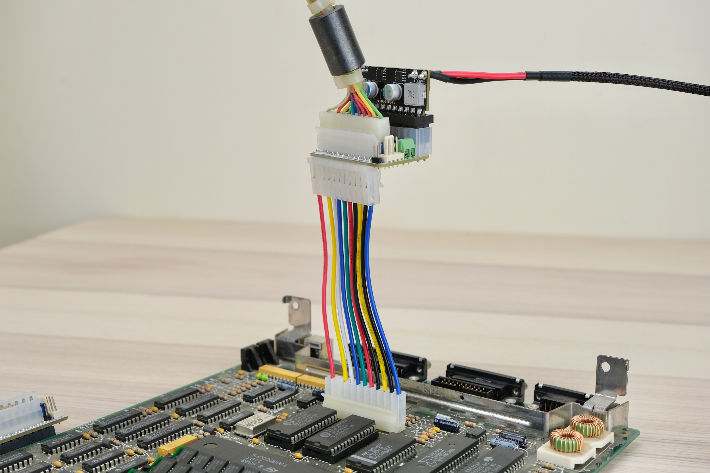

*I don't have a Mac 128K so this will have to do*

* The adaptor will be floating in mid-air, which is unfortunate. Still, make sure it does not short on other components or metal case, secure and add insulation if needed.

### Moment of Truth!

If everything checks out, take a breath and plug it in.

If your Mac was working before, hopefully it still does!

If the Mac is of unknown condition, now you'll find out!

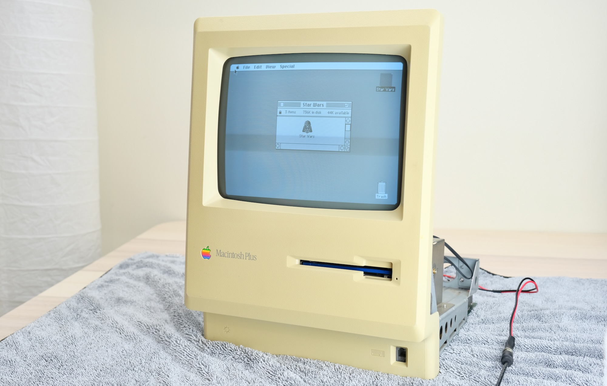

And if it doesn't work, [check out the troubleshooting guide](#troubleshooting). 

### Big Mac Fan

Those early Macs run really hot, so it's a good idea to put in a fan.

Any PC fan should work, you can run it at 12V (full speed) or 5V (quieter).

Vents on top of the case is a good location, maybe you can ziptie it there. Of course it's up to you!

**Don't mount the fan too close to the CRT**, or the picture might wobble from the motor's magnetic field.

## Power Routing

Now it works, how are we going to mount the DC jack receptacle?

I'll admit this is where things goes a bit downhill, as I can't think of a way that's **BOTH non-destructive AND elegant**.

Neat but destructive: Just drill a hole, for petes sake **DON'T DO THIS!**

Non-destructive but a bit messy: Extend the power cable though the case:

Cut the power cable in half:

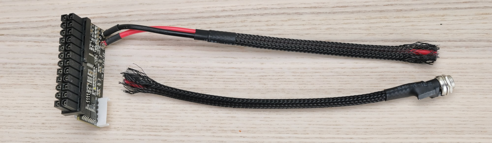

Now we're going to add some extra length.

You can solder it, but I highly recommend using lever connectors such as the ones from WAGO.

Strip the cables to the marked length, flip up, insert, flip down. Make sure the colors match.

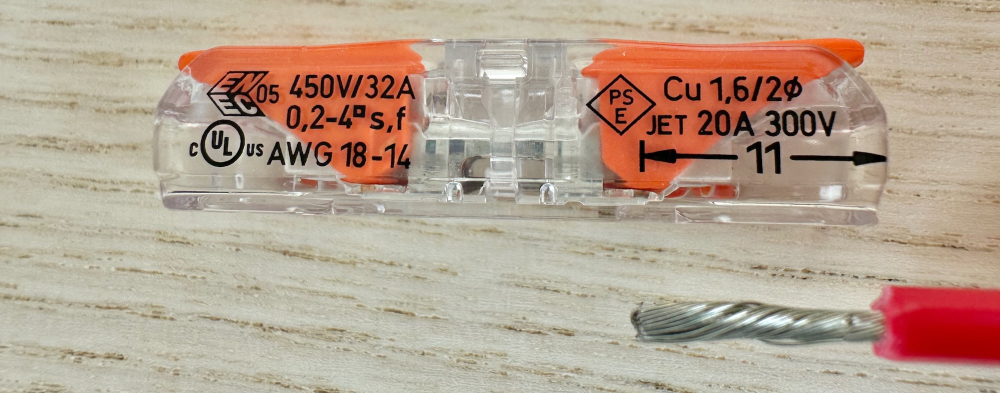

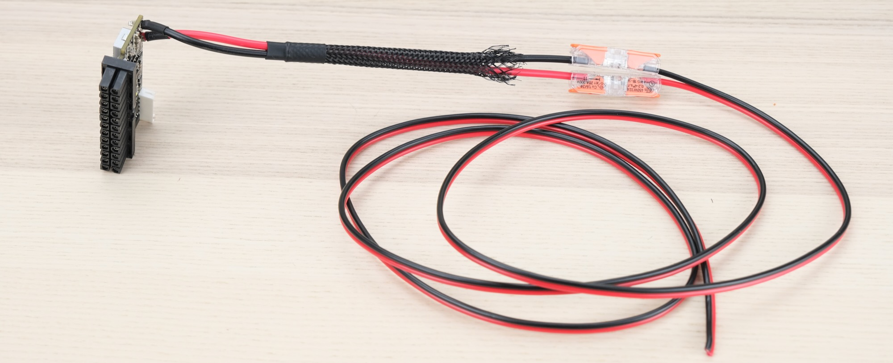

Now thread the cable through the square hole on the battery holder.

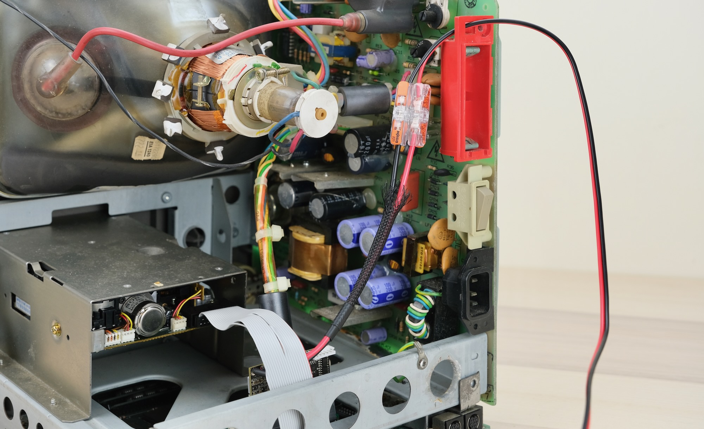

Thread it though the same hole on the back case, now you can put it back on.

Connect the other end in the same way, and **cover up the original 120/220V power port**! This way you or someone else won't accidentally plug in and blow it up.

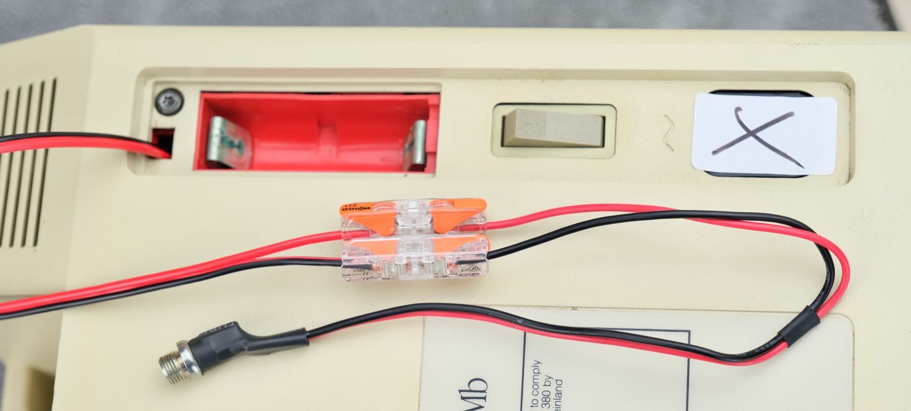

Now you just have to plug in the DC jack to turn it on.

A few extra ideas:

* Desolder the original 120/220V power port?

* Maybe wire the original power switch to the terminal block? Not sure if need to cut any traces.

And of course if you come up with better ideas, [let me know](#questions-or-comments) and I'll update it!

## Troubleshooting

This adaptor eliminates the PSU from the equation, but that's only part of the puzzle!

If something else is wrong, you still need to fix it.

### Nothing Happens

* Check for shorts on power rails, you can measure it on the back of analog board after removing the paper insulation.

* [This document](resources/plus_analog.pdf) is very helpful for finding faults on the analog board.

* Check fuse

### CRT Geometry Messed Up

I had this happen with a knock-off generic PicoPSU, changing to another one fixed it.

### Screen Wobbles

* If it happens when floppy drive is active, try using a beefier power brick, or add decoupling capacitors.

* If happens while idle, make sure the fan is not too close to the CRT.

### Other Failures

Other common issues include:

* Cracked solder joints

* Shorted tantalum capacitors

* Dirty contacts / Bad RAMs

I highly recommend watching [Adrian's Digital Basement Macintosh Repair-a-thon](https://www.youtube.com/watch?v=lKD65I86XGQ), where he covers a lot of those in detail.

The **power connector** and CRT **deflection capacitors** are notorious for cracking, here are some examples on mine:

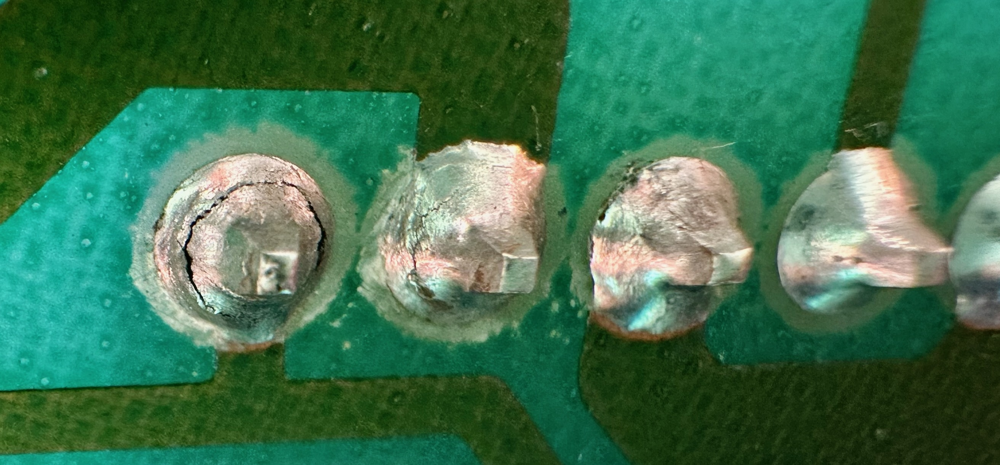

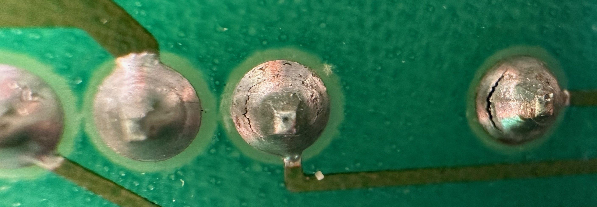

It might be very difficult to see with naked eye, so use magnification!

Flux + new solder should fix it right up, if you find one crack might as well do the whole row.

## Questions or Comments?

Feel free to ask in official [Discord Chatroom](https://discord.gg/T9uuFudg7j), raise a [Github issue](https://github.com/dekuNukem/ATX4VC/issues), or email `dekunukem` `gmail.com`!
